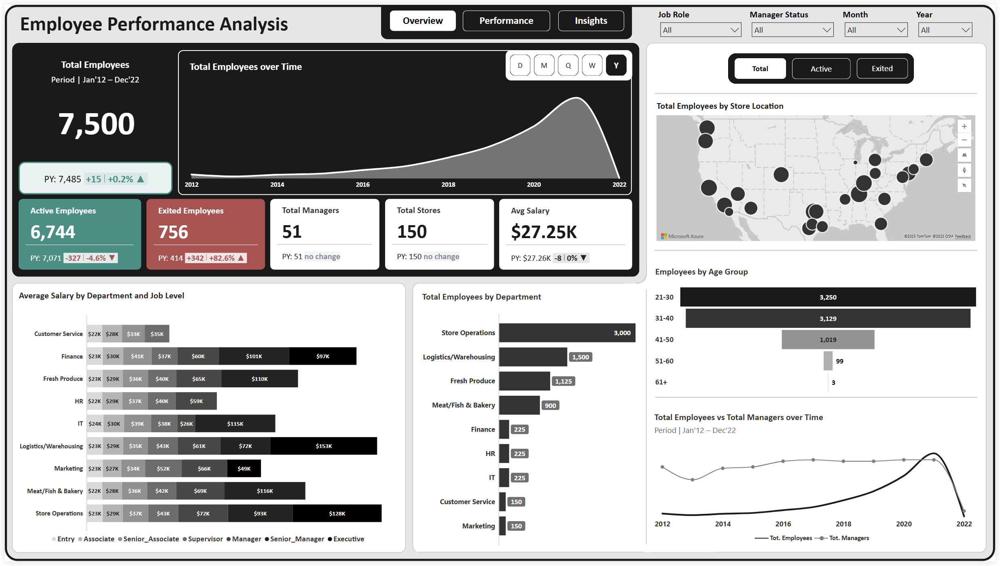
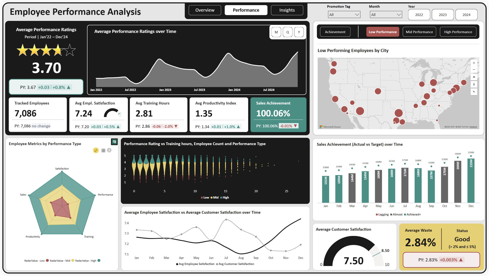
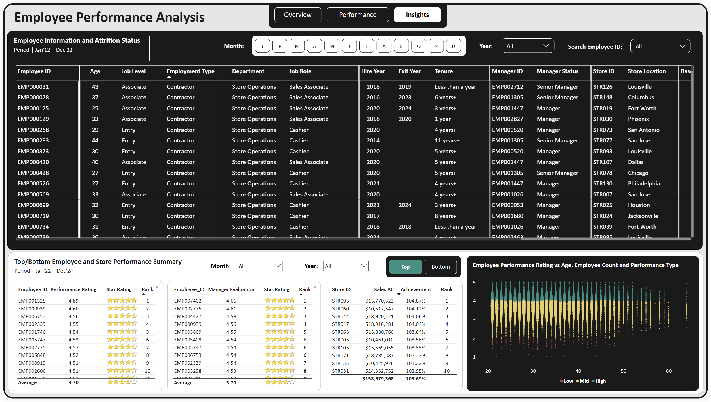

# FP20 Analytics Challenge 30 — Employee Performance Analysis  

📊 **Overview**  
This repository contains my submission for **FP20 Analytics Challenge 30**.  

Dataset covered:  
- Employee demographics & attrition  
- Salaries & job levels  
- Performance ratings  
- Business outcomes (sales, customer satisfaction, waste %)  

---

⚡ **Key Insights**  
- 7,500 employees: **6,744 active**, **756 exited**  
- Store Ops largest dept (3,000); Marketing smallest (150)  
- Attrition **highest in 31–40 age group (351 exits)**  
- Avg performance rating: **3.7/5**  
- Performance split: Low (1,646), Mid (3,188), High (2,252)  
- Sales target achievement: **100.06%**  
- Customer satisfaction: **7.5/10**  
- Waste %: **2.84% (Good)**  
- Compensation peaks at **$153K (Logistics Executives)**  

---

🛠️ **Tools Used**  
- Power BI   
- FP20 Challenge dataset  

---

🚀 **Deliverables**  
- 📊 [Interactive Dashboard](https://app.powerbi.com/view?r=eyJrIjoiNWU5NGQwZjItOGRmOS00YjE3LTljMDMtNmU0YzFkNmMxMTc4IiwidCI6IjA3NTY1ZTVjLTU2ODEtNDk5OC1hN2RjLTU1OGZiM2U2OGU3NSJ9)  
- 📄 [LinkedIn Post](https://www.linkedin.com/posts/aderibigbe-adeola_fp20analytics-fp20analyticschallenge30-powerbi-activity-7375114317035102208-0vJP?utm_source=share&utm_medium=member_desktop&rcm=ACoAADOFfMQBTxQZJTlPUmUtOmFAzu0pBMovHug)  
- ✍️ [Medium Article](SOON) - (SOON)
- 🐦 [Twitter Post](SOON) - (SOON)

---

📌 **Screenshots**  

### Overview Page  
  

### Performance Page  
  

### Insights Page  
  

---

🙌 **Acknowledgements**  
Thanks to **Federico Pastor, ZoomCharts, and EnterpriseDNA** for this dataset and challenge.  

#FP20Analytics #FP20AnalyticsChallenge30 #PowerBI #ZoomCharts #DataAnalytics #DashboardDesign #DataStorytelling
